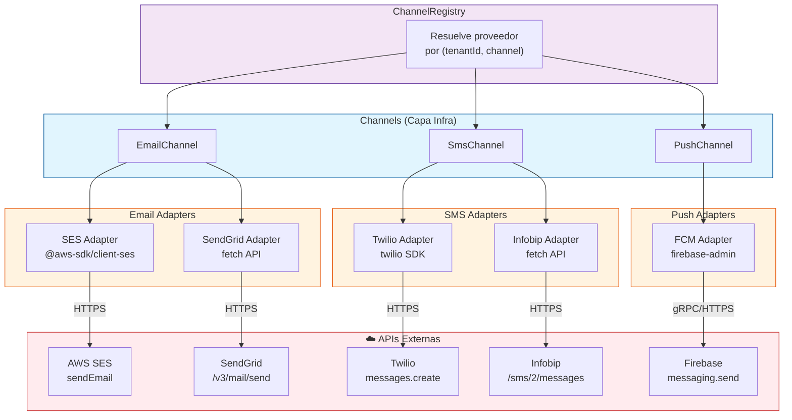
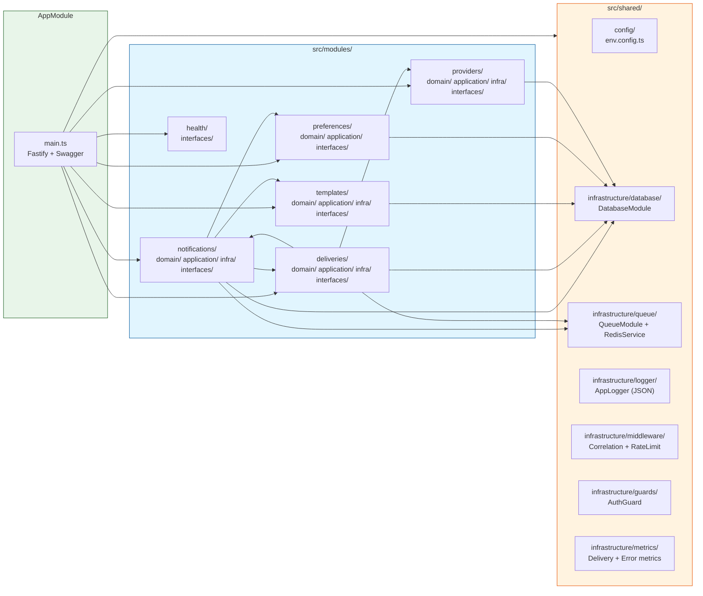
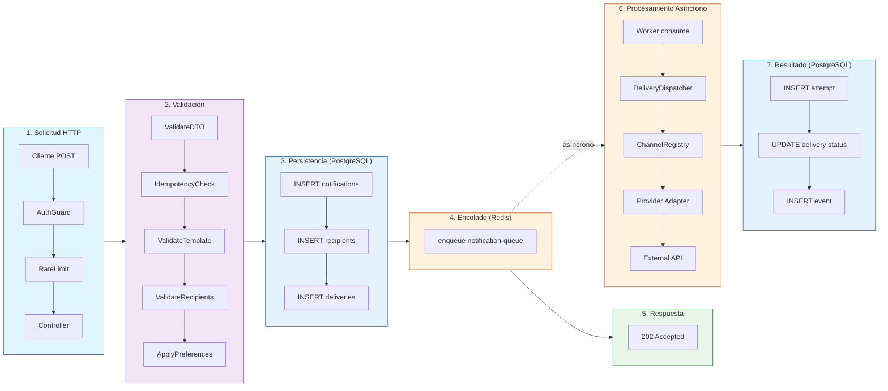

# Diagrama de Componentes — NotitifyService

## 1. Vista General de Arquitectura

```mermaid
graph TB
    subgraph Client["🖥️ Sistemas Consumidores"]
        PMS["Hotel PMS"]
        APP["Otras Apps"]
        ADM["Administrador"]
    end

    subgraph API["Capa de Presentación"]
        AG["AuthGuard<br/>(API Key / JWT)"]
        RL["RateLimitMiddleware"]
        NC["NotificationController<br/>POST /notifications<br/>GET /notifications/:id"]
        TC["TemplateController<br/>POST /templates<br/>PATCH /templates/:code/versions/:v/activate"]
        PC["PreferenceController<br/>PUT /preferences/:userId"]
        DC["DeliveryController<br/>POST /deliveries/:id/retry"]
        PrC["ProviderController<br/>POST /providers<br/>PUT /providers/:id"]
        DVC["DeviceController<br/>POST /devices<br/>DELETE /devices/:token"]
        HC["HealthController<br/>GET /health<br/>GET /health/providers"]
    end

    subgraph App["Capa de Aplicación (Use Cases)"]
        CNU["CreateNotificationUseCase"]
        ICU["IdempotencyCheckUseCase"]
        VTU["ValidateTemplateUseCase"]
        VR["ValidateRecipients"]
        AP["ApplyPreferencesUseCase"]
        CTU["CreateTemplateUseCase"]
        UTU["UpdateTemplateVersionUseCase"]
        GTU["GetTemplateUseCase"]
        TR["TemplateRenderer"]
        VL["ValidateVariablesUseCase"]
        LR["LocaleResolverUseCase"]
        PR["PreferenceResolver"]
        DD["DeliveryDispatcher"]
        RH["RetryHandler"]
        CR["ChannelRegistry"]
    end

    subgraph Domain["Capa de Dominio"]
        NE["Notification"]
        NRE["NotificationRecipient"]
        NDE["NotificationDelivery"]
        NAE["NotificationAttempt"]
        TE["Template"]
        TVE["TemplateVersion"]
        PE["Provider"]
        PrefE["Preference"]
        DevE["Device"]
       EvtE["NotificationEvent"]
        Enums["Enums<br/>(Status, Channel, etc.)"]
        VO["Value Objects<br/>(Ids, Keys)"]
        Ports["Repository Ports<br/>(Interfaces)"]
        RP["RetryPolicy"]
        EC["ErrorClassifier"]
        BS["BackoffStrategy"]
        DS["DeliveryStateMachine"]
    end

    subgraph Infra["Capa de Infraestructura"]
        subgraph Repos["Repositories (TypeORM)"]
            NRImpl["NotificationRepositoryImpl"]
            DRImpl["DeliveryRepositoryImpl"]
            ARImpl["AttemptRepositoryImpl"]
            ERImpl["EventRepositoryImpl"]
        end
        subgraph Workers["Workers y Colas"]
            DW["DeliveryWorker<br/>(BullMQ Consumer)"]
            DLQ["DeadLetterQueue"]
        end
        subgraph Adapters["Provider Adapters"]
            SES["SES Adapter"]
            TWA["Twilio Adapter"]
            FCM["FCM Adapter"]
            SGD["SendGrid Adapter"]
            IBO["Infobip Adapter"]
        end
        subgraph Render["Renderizado"]
            HR["HandlebarsRenderer"]
        end
        subgraph Obs["Observabilidad"]
            Log["AppLogger (JSON)"]
            NLog["NotificationLogger"]
            DLog["DeliveryLogger"]
            Met["DeliveryMetrics"]
            EMet["ErrorMetrics"]
            Corr["CorrelationMiddleware"]
        end
    end

    subgraph Ext["☁️ Servicios Externos"]
        AWS["AWS SES API"]
        TW["Twilio API"]
        FB["Firebase FCM"]
        SG["SendGrid API"]
        IB["Infobip API"]
    end

    subgraph Stores["💾 Persistencia y Colas"]
        PG[("PostgreSQL<br/>12 tablas")]
        RD[("Redis<br/>BullMQ + Cache")]
    end

    PMS --> AG
    APP --> AG
    ADM --> AG
    AG --> NC
    AG --> TC
    AG --> PC
    AG --> DC
    AG --> PrC
    AG --> DVC
    AG --> HC
    RL --> NC

    NC --> CNU
    NC --> NRImpl
    TC --> CTU
    TC --> UTU
    TC --> GTU
    PC --> PR
    DVC --> PR
    DC --> RH
    PrC --> CR

    CNU --> ICU
    CNU --> VTU
    CNU --> VR
    CNU --> AP
    DD --> CR
    DD --> TR
    RH --> RP
    RH --> EC
    RH --> BS
    RH --> DLQ

    DW --> DD

    CR --> SES
    CR --> TWA
    CR --> FCM
    CR --> SGD
    CR --> IBO

    SES --> AWS
    TWA --> TW
    FCM --> FB
    SGD --> SG
    IBO --> IB

    style API fill:#e1f5fe,stroke:#01579b
    style App fill:#f3e5f5,stroke:#4a148c
    style Domain fill:#e8f5e9,stroke:#1b5e20
    style Infra fill:#fff3e0,stroke:#e65100
    style Ext fill:#ffebee,stroke:#c62828
    style Stores fill:#f5f5f5,stroke:#616161,stroke-width:3px
```



---

## 2. Vista de Persistencia — PostgreSQL

```mermaid
graph TB
    subgraph Components["Componentes que acceden a PostgreSQL"]
        NRImpl["NotificationRepositoryImpl"]
        DRImpl["DeliveryRepositoryImpl"]
        ARImpl["AttemptRepositoryImpl"]
        ERImpl["EventRepositoryImpl"]
        VTU["ValidateTemplateUseCase"]
        GTU["GetTemplateUseCase"]
        CTU["CreateTemplateUseCase"]
        UTU["UpdateTemplateVersionUseCase"]
        PR["PreferenceResolver"]
        CR["ChannelRegistry"]
        PrC["ProviderController"]
    end

    subgraph PG[("PostgreSQL")]
        subgraph Core["Tablas Core"]
            T1["notifications"]
            T2["notification_recipients"]
            T3["notification_deliveries"]
            T4["notification_attempts"]
        end
        subgraph Tpl["Tablas de Plantillas"]
            T5["notification_templates"]
            T6["notification_template_versions"]
        end
        subgraph Prov["Tablas de Proveedores"]
            T7["notification_providers"]
            T8["notification_provider_channels"]
        end
        subgraph Pref["Tablas de Preferencias"]
            T9["notification_preferences"]
            T10["notification_devices"]
        end
        subgraph Aud["Auditoría"]
            T11["notification_events"]
        end
        subgraph Tenant["Multi-tenant"]
            T12["tenants"]
        end
    end

    NRImpl --> T1
    NRImpl --> T2
    NRImpl --> T3
    NRImpl --> T4

    DRImpl --> T3
    ARImpl --> T4
    ERImpl --> T11

    VTU --> T6
    GTU --> T5
    GTU --> T6
    CTU --> T5
    CTU --> T6
    UTU --> T6

    PR --> T9
    CR --> T7
    CR --> T8
    PrC --> T7
    PrC --> T8

    T1 --> T12
    T5 --> T12
    T7 --> T12
    T9 --> T12
    T11 --> T12

    style Core fill:#e3f2fd,stroke:#1565c0
    style Tpl fill:#f3e5f5,stroke:#7b1fa2
    style Prov fill:#fff3e0,stroke:#ef6c00
    style Pref fill:#e8f5e9,stroke:#2e7d32
    style Aud fill:#ffebee,stroke:#c62828
    style Tenant fill:#f5f5f5,stroke:#616161
```

### Detalle de acceso a PostgreSQL

| Componente | Tabla | Operación | Propósito |
|------------|-------|-----------|-----------|
| NotificationRepositoryImpl | notifications | R/W | Persistir y consultar notificaciones |
| NotificationRepositoryImpl | notification_recipients | R/W | Destinatarios por notificación |
| NotificationRepositoryImpl | notification_deliveries | R/W | Entregas por canal |
| NotificationRepositoryImpl | notification_attempts | R | Cargar intentos al consultar |
| DeliveryRepositoryImpl | notification_deliveries | R/W | Actualizar estado de entregas |
| AttemptRepositoryImpl | notification_attempts | W | Registrar cada intento de envío |
| EventRepositoryImpl | notification_events | W | Auditoría de every state transition |
| ValidateTemplateUseCase | notification_template_versions | R | Verificar versión activa existe |
| CreateTemplateUseCase | notification_templates + versions | W | Crear plantilla y versiones |
| UpdateTemplateVersionUseCase | notification_template_versions | W | Activar/desactivar versiones |
| GetTemplateUseCase | notification_templates + versions | R | Obtener plantilla con versiones |
| PreferenceResolver | notification_preferences | R | Consultar preferencias de usuario |
| ChannelRegistry | notification_providers + channels | R | Resolver proveedor por canal |
| ProviderController | notification_providers + channels | W | Configurar proveedores y mapeo |

---

## 3. Vista de Colas y Cache — Redis / BullMQ

```mermaid
graph TB
    subgraph Producers["Productores (enqueue)"]
        CNU["CreateNotificationUseCase"]
        RH["RetryHandler"]
        DC["DeliveryController<br/>(retry manual)"]
    end

    subgraph Consumer["Consumidor (dequeue)"]
        DW["DeliveryWorker<br/>(BullMQ Worker)"]
    end

    subgraph DLQComp["Dead Letter"]
        DLQ["DeadLetterQueue"]
    end

    subgraph Cache["Cache"]
        PRCache["ProviderRegistry<br/>(TTL 300s)"]
    end

    subgraph Redis[("Redis")]
        Q1["notification-queue<br/>(jobs de entrega)"]
        Q2["retry-queue<br/>(jobs con delay/backoff)"]
        Q3["dead-letter-queue<br/>(entregas agotadas)"]
        Cache1["provider:tenantId:channel<br/>(cache de configuración)"]
    end

    CNU -->|enqueue| Q1
    DC -->|enqueue| Q1
    RH -->|enqueue con delay| Q2
    DLQ -->|enqueue| Q3

    Q1 -->|consume| DW
    Q2 -->|consume| DW

    PRCache -->|GET/SET TTL 300s| Cache1

    DW -->|on failure →| RH
    RH -->|if exhausted →| DLQ

    style Producers fill:#e1f5fe,stroke:#01579b
    style Consumer fill:#fff3e0,stroke:#e65100
    style DLQComp fill:#ffebee,stroke:#c62828
    style Cache fill:#e8f5e9,stroke:#1b5e20
    style Redis fill:#f5f5f5,stroke:#616161,stroke-width:3px
```

### Detalle de uso de Redis

| Componente | Estructura Redis | Tipo | Propósito |
|------------|------------------|------|-----------|
| CreateNotificationUseCase | notification-queue | BullMQ Queue | Encolar job tras persistir notificación |
| DeliveryWorker | notification-queue | BullMQ Worker | Consumir jobs y procesar entregas |
| DeliveryWorker | retry-queue | BullMQ Worker | Consumir retries con backoff delay |
| RetryHandler | retry-queue | BullMQ Queue | Encolar retry con delay exponencial |
| DeliveryController | notification-queue | BullMQ Queue | Re-encolar delivery para retry manual |
| DeadLetterQueue | dead-letter-queue | BullMQ Queue | Mover entregas que agotaron reintentos |
| ProviderRegistry | provider:{tenant}:{channel} | Redis String (TTL 300s) | Cachear configuración de proveedor por canal |

---

## 4. Vista de Proveedores Externos



### Mapeo Canal → Proveedor (configurable)

| Canal | Proveedor Inicial | Proveedor Alternativo | Cambio sin tocar dominio |
|-------|-------------------|----------------------|------------------------|
| EMAIL | AWS SES | SendGrid | ✅ Solo cambiar adapter |
| SMS | Twilio | Infobip | ✅ Solo cambiar adapter |
| PUSH | Firebase FCM | — (futuro) | ✅ Solo cambiar adapter |

---

## 5. Vista de Módulos NestJS



---

## 6. Flujo de Datos End-to-End



---

## Leyenda

| Capa | Color | Responsabilidad |
|------|-------|-----------------|
| Presentación | Azul | Controllers HTTP, AuthGuard, RateLimit |
| Aplicación | Morado | Use cases, orquestación de flujos |
| Dominio | Verde | Entidades, value objects, enums, ports |
| Infraestructura | Naranja | Repositories, adapters, workers, logger, Redis |
| Externos | Rojo | APIs de proveedores (SES, Twilio, FCM, SendGrid, Infobip) |
| PostgreSQL | Azul oscuro | 12 tablas con FK, índices, constraints |
| Redis | Gris | BullMQ (3 colas) + Cache (provider config TTL 300s) |
