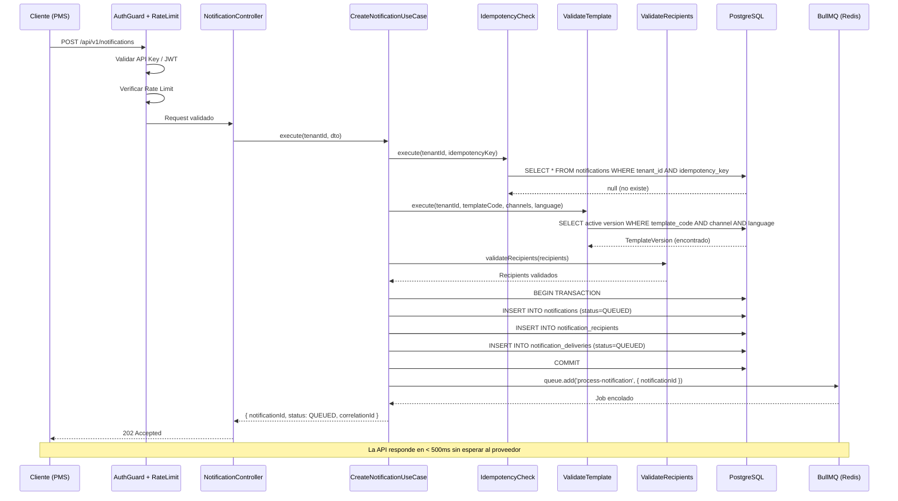
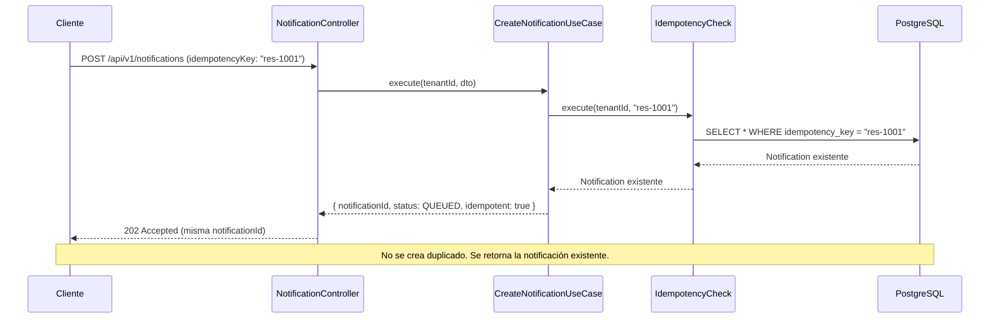
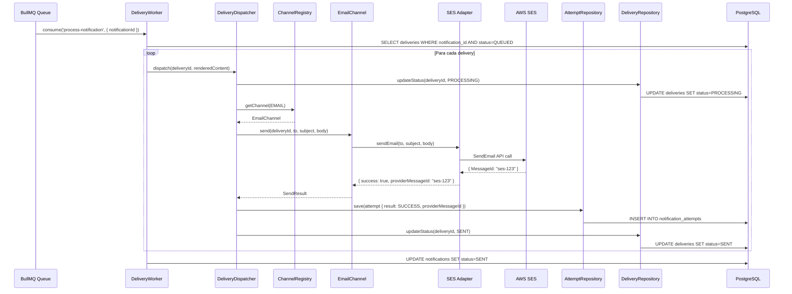
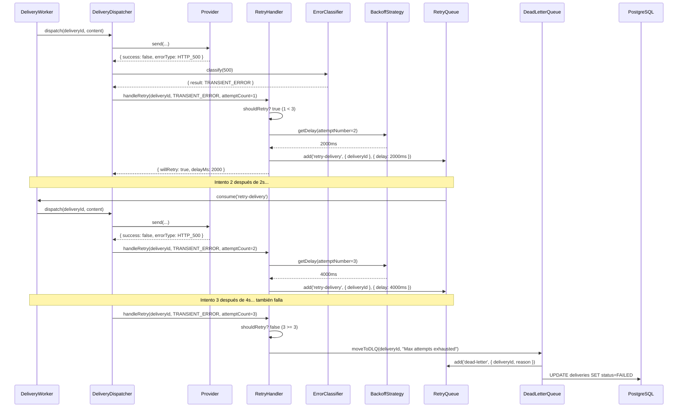
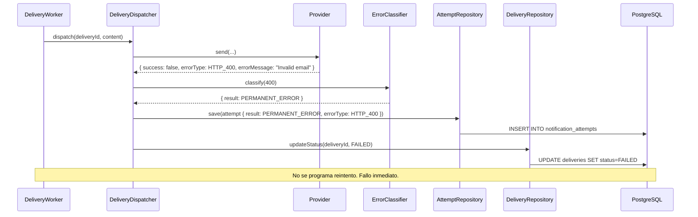
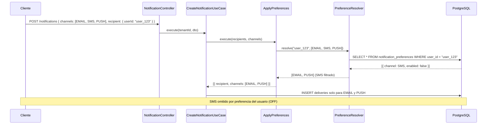
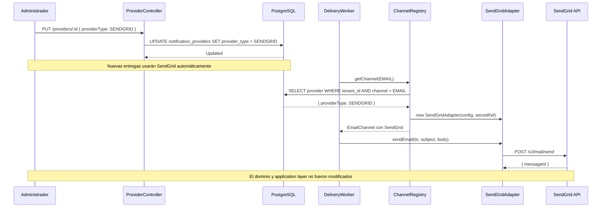

# Diagrama de Secuencia — NotitifyService

## 1. Crear Notificación (API → 202 Accepted)

## 2. Idempotencia — Solicitud Duplicada

## 3. Procesamiento Asíncrono (Worker → Provider)

## 4. Reintentos con Backoff Exponencial

## 5. Error Permanente (No Retry)

## 6. Preferencias de Usuario

## 7. Cambio de Proveedor (Swap sin modificar dominio)

